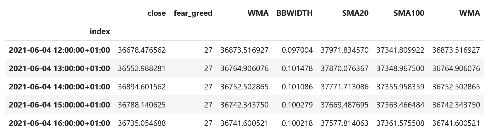
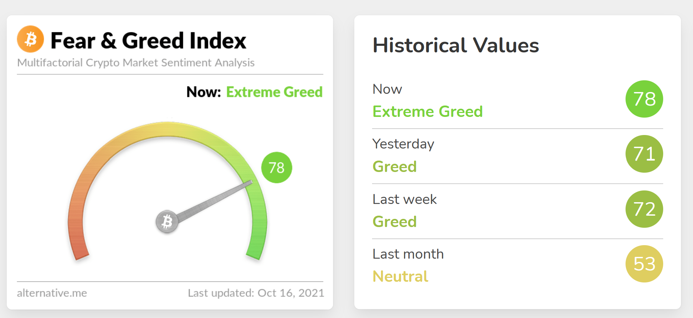
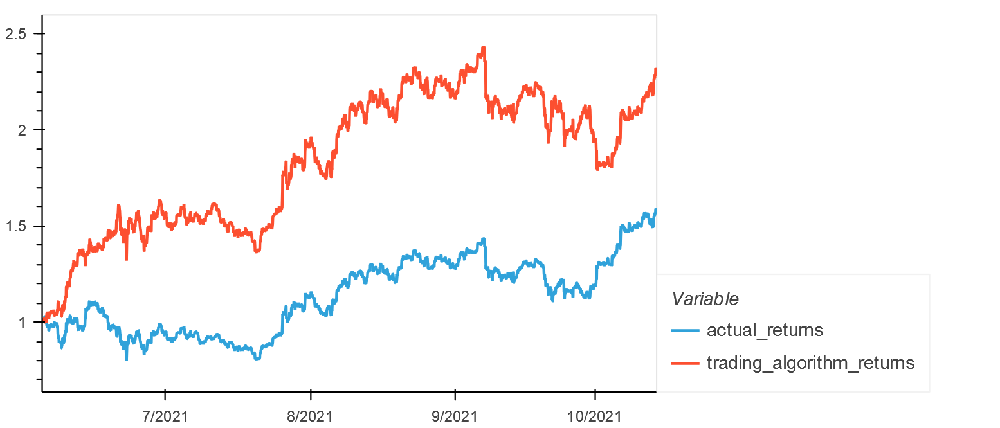

<div id="top"></div>


<!-- PROJECT LOGO -->
<br />
<div align="center">
  <a href="https://github.com/github_username/repo_name">
    
  </a>


<h3 align="center">Marketwhale</h3>

  <p align="center">
MarketWhale is a project dedicated to researching, testing, and providing users with machine learning enhanced algorithmic trading bots that make accurate predictions for crypto currency.
    <a href="https://github.com/woodedlawn/marketwhale.git">View Demo</a>
  </p>
</div>

<!-- TABLE OF CONTENTS -->
<details>
  <summary>Table of Contents</summary>
  <ol>
    <li>
      <a href="#about-the-project">About The Project</a>
      <ul>
        <li><a href="#built-with">Built With</a></li>
      </ul>
    </li>
    <li>
      <a href="#getting-started">Getting Started</a>
      <ul>
        <li><a href="#installation">Installation</a></li>
      </ul>
    </li>
    <li><a href="#Sample Data">Sample Data</a></li>
    <li><a href="#license">License</a></li>
    <li><a href="#contact">Contributing</a></li>
    <li><a href="#references">References</a></li>
    <li><a href="#acknowledgments">Acknowledgments</a></li>
  </ol>
</details>

<!-- ABOUT THE PROJECT -->
## About The Project
The project utilizes SVM, LSTM, and CNN models in order to forecast future crypto prices. Based on testing, the model for SVM that utilizes the fear and greed index performs better than LSTM/CNN models. Future steps involve creating a hybrid of LSTM and CNN models with the fear and greed index to increase accuracy. In general, machine learning models tend to have prediction rates above 50% which is considered good but application using live data tends to perform worse than prediction. Once the models are complete, backtesting will be performed to check degree of accuracy and if predications can be applied to live data. There are also plans to integrate trading strategies into the algorithm and utilize 1-minute price data instead of hourly data. Increasing accuracy above 51 - 53% percent and making sure that the model performs well in the market is a future goal of our company.

<p align="right">(<a href="#top">back to top</a>)</p>

### Built With

* python 3.7.10
* jupyterlab 3.0.14
* pandas 1.2.4
* yfinance 0.1.63
* numpy 1.19.5
* hvplot 0.7.3
* math 1.2.1
* finta 1.3
* scikit-learn 0.24.1
* tensorflow 2.6.0
* sci-kit learn 0.22.2.post1

<p align="right">(<a href="#top">back to top</a>)</p>

<!-- GETTING STARTED -->
## Getting Started

To setup this algorithm locally on your desktop, please clone the repo.
After cloning the repo, you can run the program utilizing jupyter lab/notebook.

The machine learning model was run using Google Colab. 
A saved LSTM and CNN model is saved in json and you can use those models so you won't have to import the ipynb file to Google Colab to re-run the model. 

### Installation

1. Clone the repo
   ```sh
   git clone 
   ```
2. Install required python packages listed in the ipynb file. 
   ```sh
   use conda or pip install
   ```
3. Run the file in jupyter lab/notebook

<p align="right">(<a href="#top">back to top</a>)</p>

<!-- Sample Data -->
## Sample Data
SVM Model is shown below. 

  


<p align="right">(<a href="#top">back to top</a>)</p>

<!-- LICENSE -->
## License

Distributed under the MIT License.
See [license txt](https://github.com/git/git-scm.com/blob/main/MIT-LICENSE.txt)

<p align="right">(<a href="#top">back to top</a>)</p>

<!-- CONTRIBUTERS -->
## Contributers

* Jonathan Woolsey - neural network
* Rodrigo Monge - algorithmic trading
* Jasmine Tengsico - research 

Project Link: [https://github.com/woodedlawn/marketwhale.git](https://github.com/woodedlawn/marketwhale.git)
<p align="right">(<a href="#top">back to top</a>)</p>

<!-- References -->
## References
Research related resources and repos. 
* [CNN-LSTM Crypto Forecasting](https://machinelearningmastery.com/backtest-machine-learning-models-time-series-forecasting/)
* [Cryptocurrency price prediction models](https://academic.microsoft.com/paper/3125634108/citedby/search?q=Anticipating%20cryptocurrency%20prices%20using%20machine%20learning&qe=RId%253D3125634108&f=&orderBy=0)
* [Neural Networks for Algorithmic Trading](https://alexrachnog.medium.com/neural-networks-for-algorithmic-trading-backtesting-in-pandas-4940fec2175e)
* [Backtesting for stocks](https://machinelearningmastery.com/backtest-machine-learning-models-time-series-forecasting/)
* [Using saved ML models](https://towardsdatascience.com/saving-and-loading-keras-model-42195b92f57a)
* [Brief overview of neural network](https://github.com/VivekPa/IntroNeuralNetworks?ref=pythonrepo.com)
<p align="right">(<a href="#top">back to top</a>)</p>


<!-- ACKNOWLEDGMENTS -->
## Acknowledgments
Credit to creator of readme template. The repo also has useful resources. 
* [README Template](https://github.com/othneildrew/Best-README-Template.git)

<p align="right">(<a href="#top">back to top</a>)</p>
